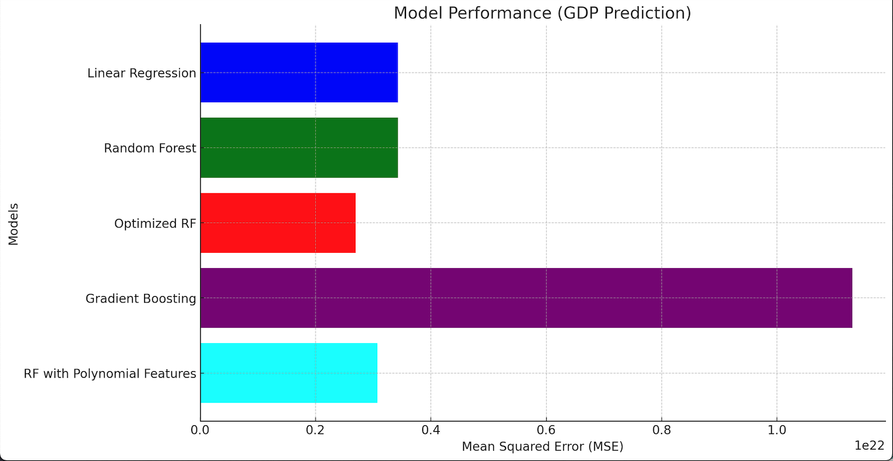
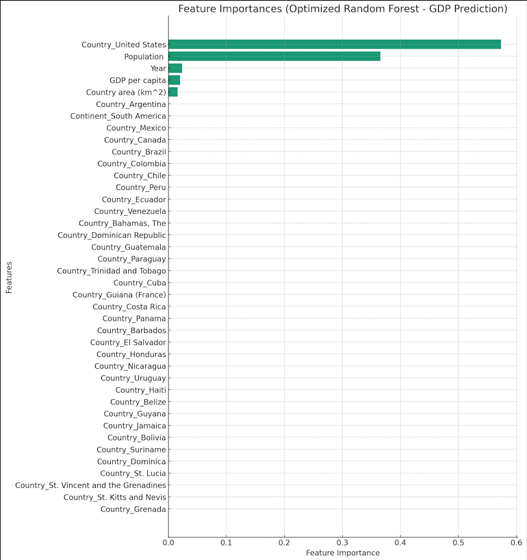

# Data Analysis on American Countries' Economic Indicators

An in-depth analysis of economic indicators such as GDP, Population, and GDP per capita across various American countries.

## Table of Contents
- [Introduction](#introduction)
- [Data Preprocessing](#data-preprocessing)
- [Exploratory Data Analysis](#exploratory-data-analysis)
- [Model Building & Evaluation](#model-building--evaluation)
- [Visualizations](#visualizations)
- [Conclusion](#conclusion)
- [Acknowledgements](#acknowledgements)

---

## Introduction

This project aims to analyze and predict economic indicators of various countries in America. The primary focus is on GDP, Population, and GDP per capita, leveraging several machine learning models and techniques.

---

## Data Preprocessing

The dataset underwent several preprocessing steps to ensure its quality and reliability:
- Handled missing values, primarily in the GDP column, using median imputation.
- Converted data types to their appropriate format, e.g., population figures to integers.

---

## Exploratory Data Analysis

The dataset was explored to understand the distribution of key indicators and the relationship between different variables. Here are some key insights:

- In the latest year available, the **United States** stands out with the highest GDP, while **Dominica** trails with the lowest.
- Over the span of the dataset, the **United States** has seen a considerable surge in GDP. In contrast, **Brazil** has faced a decline, marking the most significant drop among all countries.
- Population-wise, the **United States** houses the most significant number of people, whereas **St. Kitts and Nevis** has the smallest population.
- Evaluating the GDP per capita, the **United States** again takes the lead, showcasing robust economic health. In stark contrast, **Haiti** struggles with the lowest GDP per capita.

---

## Model Building & Evaluation

Several models were built to predict the GDP, Population, and GDP per capita of countries. The models used include:
- Linear Regression
- Random Forest Regressor
- Gradient Boosting Regressor

The performance of these models was evaluated using the Mean Squared Error (MSE) metric. [Optimized Random Forest](main.py) emerged as the most promising model for GDP prediction.

---

## Visualizations

Visual aids were extensively used to gain insights and present findings:
- Bar charts to compare the performance of various models.

- Feature importance plots to understand the significance of different predictors in the Random Forest model.

---

## Conclusion

The project offered valuable insights into the economic indicators of American countries. Machine learning models, especially tree-based algorithms, proved effective in predicting GDP and other indicators, although there's potential for further optimization and exploration.

---

